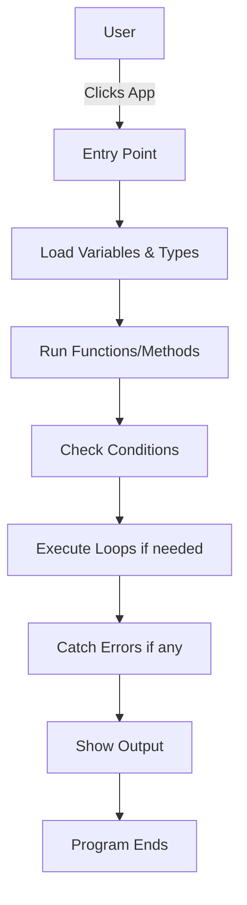

# 🧠 Anatomy of a Program: A Beginner's Guide to Understanding Code in the .NET World

---

## 📚 Table of Contents

* [What Is a Program?](#what-is-a-program)
* [🧩 Anatomy of a Program](#anatomy-of-a-program)

  * [1. Entry Point](#1-entry-point)
  * [2. Variables](#2-variables)
  * [3. Data Types](#3-data-types)
  * [4. Functions / Methods](#4-functions--methods)
  * [5. Classes and Objects](#5-classes-and-objects)
  * [6. Conditionals](#6-conditionals)
  * [7. Loops](#7-loops)
  * [8. Error Handling](#8-error-handling)
  * [9. Comments](#9-comments)
  * [10. Namespaces and Imports](#10-namespaces-and-imports)
* [⚙️ .NET Tech Stack](#️-net-tech-stack)
* [📈 Workflow Diagram](#workflow-diagram)
* [🧠 Summary](#summary)

---

## What Is a Program?

A **program** is a set of instructions that tells a computer what to do. These instructions are written using a **programming language** and processed by a compiler or interpreter to produce meaningful output or actions.

---

## 🧩 Anatomy of a Program

Below are the core building blocks of a typical program in **C#**, **JavaScript**, and other .NET-compatible languages like **F#** and **VB.NET**.

### 1. Entry Point

This is where the program begins executing.

```csharp
// C# Entry Point
class Program {
    static void Main(string[] args) {
        Console.WriteLine("Hello World");
    }
}
```

```javascript
// JavaScript Entry Point (in browser)
console.log("Hello World");
```

### 2. Variables

Variables store data values.

```csharp
int age = 30; // integer variable
string name = "Alice"; // string variable
```

```javascript
let age = 30;
const name = "Alice";
```

### 3. Data Types

Defines the kind of value a variable holds.

* **int**: whole number
* **string**: text
* **bool**: true or false
* **float/double**: decimal numbers

### 4. Functions / Methods

Reusable blocks of code that perform a task.

```csharp
void Greet(string name) {
    Console.WriteLine("Hello " + name);
}
```

```javascript
function greet(name) {
    console.log("Hello " + name);
}
```

### 5. Classes and Objects

Used in object-oriented programming to bundle data and methods together.

```csharp
class Dog {
    public string Name;
    public void Bark() {
        Console.WriteLine("Woof!");
    }
}
```

### 6. Conditionals

Allow programs to make decisions.

```csharp
if (age > 18) {
    Console.WriteLine("Adult");
}
```

```javascript
if (age > 18) {
    console.log("Adult");
}
```

### 7. Loops

Repeat actions.

```csharp
for (int i = 0; i < 5; i++) {
    Console.WriteLine(i);
}
```

```javascript
for (let i = 0; i < 5; i++) {
    console.log(i);
}
```

### 8. Error Handling

Protects code from breaking during runtime.

```csharp
try {
    int x = int.Parse("abc");
} catch (Exception ex) {
    Console.WriteLine("Error: " + ex.Message);
}
```

### 9. Comments

Help explain code to humans.

```csharp
// This is a single-line comment
```

```javascript
// This is a comment
```

### 10. Namespaces and Imports

Allow organization and reuse of code.

```csharp
using System; // Imports built-in .NET namespace
```

```javascript
import fs from 'fs'; // Import file system module in Node.js
```

---

## ⚙️ .NET Tech Stack


---

## 📈 Workflow Diagram



---

## 🧠 Summary

Every program—whether it's written in **C#**, **JavaScript**, or another .NET-supported language—follows a similar structure made up of parts you can learn one-by-one. Think of a program like a machine: you put parts together and give it a job to do.

Understanding these parts is your first step in becoming a software developer. Welcome to the journey!
